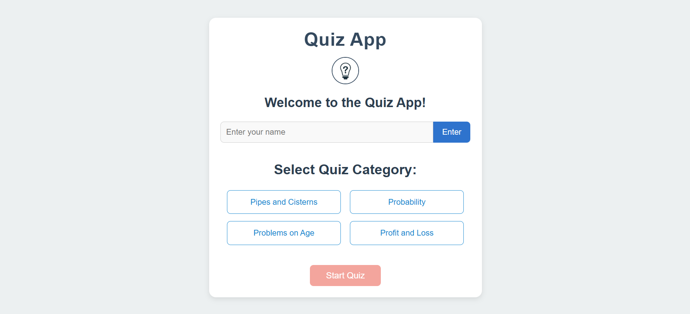
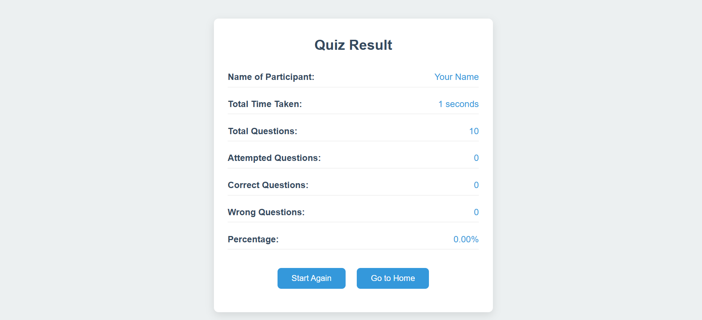

# Quiz App

Welcome to the **Quiz App**, a fun platform to test your knowledge with quizzes across various categories.

---

## Features

- **Simple Interface**: Easy to use design.
- **Multiple Categories**: Topics include Pipes and Cisterns, Probability, and more.
- **Real-Time Scoring**: Instant score updates.
- **Timer**: Tracks time per question.
- **Responsive Design**: Works on all devices.

---

## Screenshots

### Home Page
Landing page for name entry and category selection.



### Quiz Result Page
Quiz interface with quiz application scoring.



---

## Project Files

```
quiz-app/
|-- index.html       # Landing page
|-- quiz_page.html   # Quiz interface
|-- questions.js     # Quiz questions
|-- styles.css       # Styles
|-- script.js        # App logic
|-- images/          # App images
```

---

## Usage

1. Launch `index.html` in your browser.
2. Enter your name and click "Enter."
3. Pick a category and click "Start Quiz."
4. Answer questions, track your score, and submit the quiz to finish.

---

**Live Demo**:

You can try Live Demo, [Click here :)]()